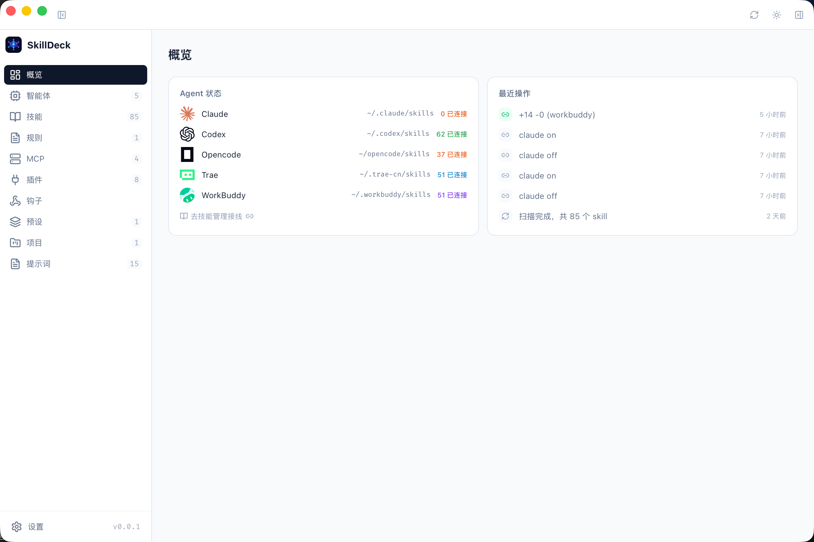
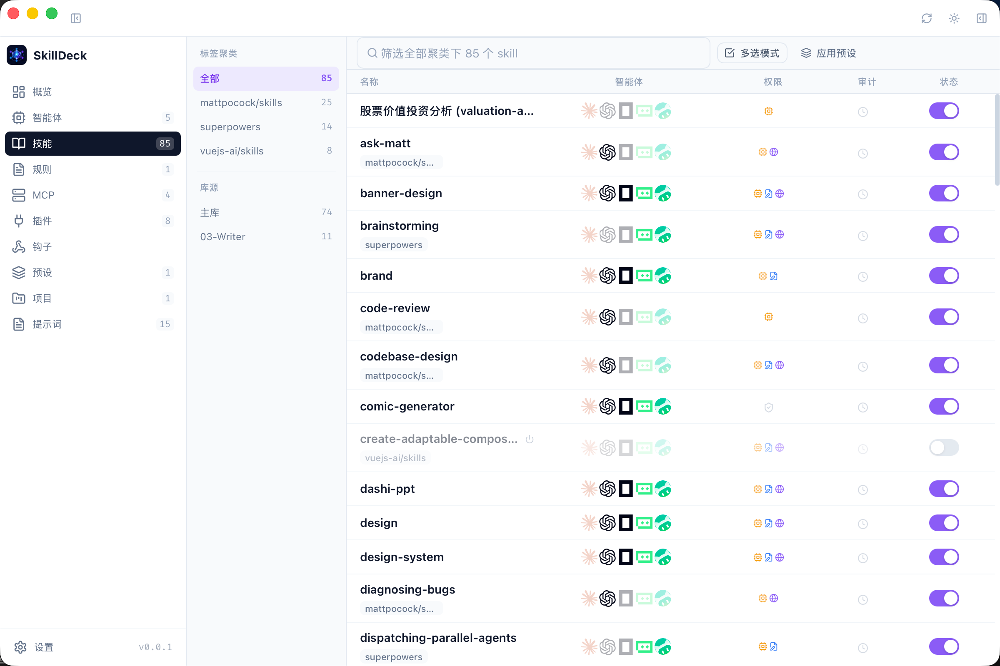
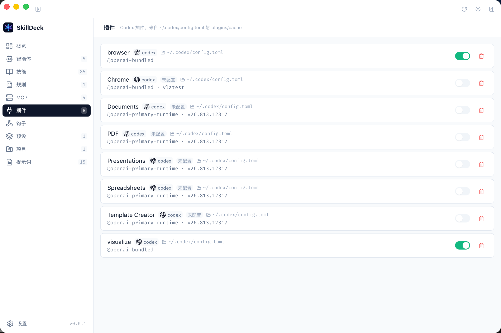
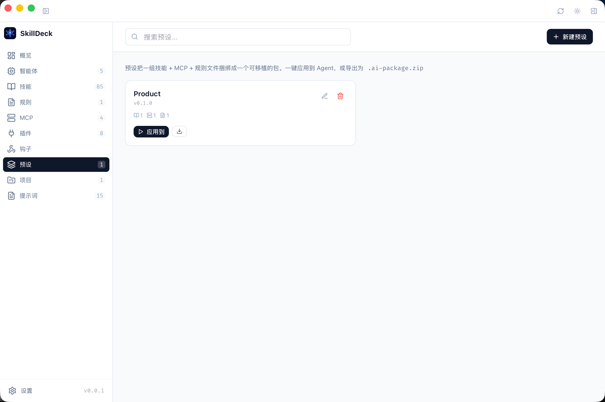

# SkillDeck

SkillDeck 是一个本地 AI Skill 管理器，用来集中管理 Skills、Prompts、Rules、MCP、Plugins、Hooks 和工具集，并按需接入 Claude、Codex、Trae、WorkBuddy 等 Agent。

它的核心目标不是把所有能力一直挂载到每个 Agent，而是维护一个可筛选、可编辑、可接线的本地能力库：需要哪些能力，就接入哪些能力；场景变了，就切换对应组合。

## 预览









## 功能

- **Skill 库源管理**：登记多个本地库源，扫描 `SKILL.md`，查看描述、标签、权限和内容。
- **Agent 接线**：为 Skill 创建或断开到各 Agent skills 目录的链接，支持单选和批量操作。
- **冲突识别**：区分软链接、真实目录和真实文件，避免误删或覆盖已有入口。
- **场景预设**：按场景维护 Skill 组合，一键切换当前 Agent 的能力挂载。
- **能力资产管理**：管理 Prompts、Rules、MCP、Plugins、Hooks 和项目工具集。
- **本地数据**：数据和 SQLite 数据库保存在本机，不依赖云端服务。

## 技术栈

- 桌面壳：Tauri 2
- 前端：React、TypeScript、Vite、Tailwind CSS、Zustand
- 后端逻辑：Rust、rusqlite

## 开发

要求：

- Node.js 20+
- npm 10+
- Rust stable
- Tauri 2 的平台依赖

常用命令：

```bash
npm ci
npm run dev          # 启动前端开发服务
npm run tauri:dev    # 启动桌面应用开发模式
npm test             # 运行前端单元测试
npm run test:layout  # 运行布局与 Tauri 窗口契约检查
npm run build        # TypeScript 检查并构建前端
npm run tauri:build  # 构建桌面安装包
```

Rust 侧检查：

```bash
cd src-tauri
cargo check --locked
cargo test --locked
```

## 数据位置

macOS 数据目录：

```text
~/Library/Application Support/skilldeck
```

主要文件：

- `skilldeck.db`：SQLite 数据库
- `~/.skilldeck/skills`：全新安装的默认主库源

已有 `ai-hub` 数据库会在首次启动 SkillDeck 时复制到新的数据目录，原文件保留不删。

## 发布

Release 由 GitHub Actions 自动构建：

1. 提交并推送代码到 `main`。
2. 创建版本标签并推送，例如 `v0.0.1`。
3. `v*` 标签触发 `.github/workflows/release.yml`。
4. Actions 构建 macOS universal DMG 和 Windows x64 安装包，自动生成 Release Notes 并发布到 GitHub Releases。

```bash
git tag v0.0.1
git push origin v0.0.1
```

## 项目结构

```text
src/               React 界面与前端状态
src-tauri/         Rust 命令、扫描器、数据库与桌面壳
scripts/           本地测试脚本
tests/             前端单元测试
```

## 仓库

GitHub：<https://github.com/tingke/skill-deck>
